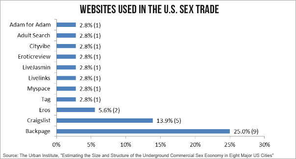

## Topic: Predict risk of falling prey to online Sex Trade

We, [Simran](https://github.com/simrnsethi) and [I](https://github.com/akshi8/Risk-predictor) built a WebApp to identify individuals who are at risk of online sex-work based using machine learning algorithm for prediction and R-shiny for visualization.

## Event

* Hack For Humanity [Girls in Tech](https://devpost.com/software/online-sex-work-risk-prediction)
* 24 hour Hackathon on data science for social good

## WebApp

* The app can be found at : [Online Sex-Work Risk Predictor](https://akshi8.shinyapps.io/Risk-predictor/). Explore yourself!

## Inspiration 💡

This app has been developed in order to predict the risk for an individual to be a victim of online sex trade or getting drawn into online sex work. A lot of users on adult website fall prey to the sex-trade and human trafficking and online platforms contribute almost 50% of sex-trade venue [source](https://www.dailydot.com/irl/sex-industry-internet-online-report/). Sex trafficking and child pornography are very big issues and gross violation of humanity. This analysis deployed on the WebApp can be used by law enforcement bodies (Police), social groups, college authorities to gauge the effect of certain individuals based on their online activity on such sites to protect them from the harm of sex-trade and potential drug abuse. ❤️

## What does the App do?

It predicts the risk of an innocent individual (on an adult website) falling prey to the web of online sex-work by using their preferences and online activity. These user characteristics and online activity are used as features to understand and predict their susceptibility to such risky business. The data used to build this app can be found [here](https://www.kaggle.com/panoskostakos/online-sex-work). This database was used in the paper: “Covert online ethnography and machine learning for detecting individuals at risk of being drawn into online sex work”

* Data based on app user selections can also be downloaded from the app for further analysis or record keeping

## How we built it 👩
💻

- Using R for data wrangling and data cleaning as data from this websites can be high anonymized and messy.
    - User profile data has the following fields which were used in the prediction
     * Gender, Age, Location, Verification
     * Sexual_orientation, Sexual_polarity,Looking_for
     * Last_login, Number_of_Comments_in_public_forum, Time_spent_chating
     * Number_of_offline_meetings_attended
     * Profile_pictures

- The prediction is done through a machine learning classifier "Random Forest" in R
- The final web-app is deployed using shiny library in R

## Challenges we ran into 🚵

- Inadequate data
- Anonymized data-fields
- Implementing some user inputs for more interactibility due to time constraints
- Lower Score of prediction algorithm based on training data

## Accomplishments that we're proud of 😍

Building and deploying a working machine learning model within 10 hours of the inception of its idea! And, getting 72% accuracy on our classification model on our first try.

## What we learned 🧐

We learned based on the online-activity and individual characteristics there can be a high risk of teens and young adults falling prey to online sex work or the sex trade. Most sexual predators (pimps) lure underage users with the help of limited profile information

## What's next for Online Sex-work Risk Prediction 🔍

With the availability of more data and data-sources, the online-sex-work-predictor will have more robust predictions
Also, We will be using a web-API to extract data for predicting some individual is at Risk

## Additional Stats

