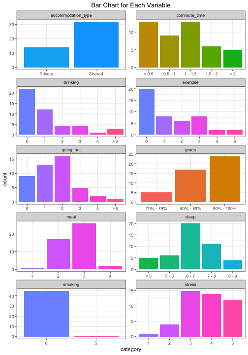
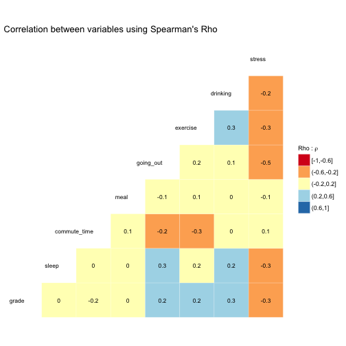

# Sleep Matters 😴

## Survey Design and Statistical Analysis , April 2018

**Collaborators:**
- [Xin (Alex) Guo](https://github.ubc.ca/alexguox)
- [Cem Sinan Ozturk](https://github.ubc.ca/cemsinan)

- **This survey was created using [Google Forms](https://www.google.ca/forms/about/) and can be found [here](https://goo.gl/forms/RnSzp6LJHi78rYhF2).**

- **Final Report in md version, please click [here](https://github.com/akshi8/Sleep-Matters/blob/master/Report/Final_Report.md)**

## The Question

The survey question is **"How does sleeping duration affect student's MDS performance (grade)?"**

- We believe sleep has a significant effect on students' grades. Therefore, we would like to test our hypothesis by conducting a survey in which we will ask several questions to find out the validity of our belief.

## Survey Analysis

We collected data into the following survey via Google Survey Tool. survey questions and survey data is accessible on following links.

- *This survey was created using [Google Forms](https://www.google.ca/forms/about/) and can be found [here](https://goo.gl/forms/RnSzp6LJHi78rYhF2).*

We applied Ordinal Regression analysis onto our survey outcome which can be found on final report.

## Results and Conclusion

#### Survey data for each analysis variable

#### Correlation plot of each variable
* For categorical variables, the concept of correlation can be understood in terms of significance test and effect size (strength of association).
* The measure of association indicates the strength of the relationship, whether, weak or strong but it does not indicate causality.

- Exercise has a weak negative correlation with stress and commute_time with correlation coefficient rho as -0.3.  
- Grades have weak negative correlation with stress with rho as -0.3.
- Another interesting observation we found was stress and going out and exercise are negatively correlated with rho as -0.5.

#### Model Selection

- Since our response variable `grade` is an ordinal variable, we choose the cumulative link models (CLMs) to fit our data.

#### Significance testing and results

- In summary, sleeping for `6 - 7 hours`, instead of less than 5 hours, will increase the log odds of getting a better grade; sleep for `8 - 9 hours`, instead of 6 - 7 hours, will decrease the log odds of getting a better grade.

- Therefore, `6 - 7` hours seems the best sleep duration for a better grade. Too little sleep may affect the efficiency of study, and too much sleep will take away the study time.

## Running the Analysis

Clone the repo for your survey that using the instruction in:

[Project Repo](https://github.com/akshi8/Sleep-Matters/blob/master/README.md)
