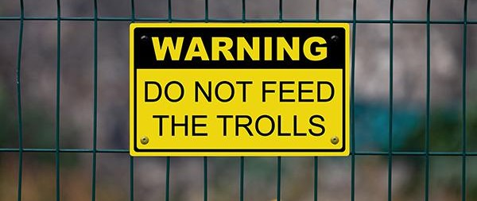

# The Grand Social Media Experiment of Fake News

------------
##### A report on how Facebook and certain social media were used to meddle in elections around the world and how the tech giants are using A/B testing to tackle it
-------

> `Introduction`

The role of social media in political campaigns have never been so prominent like the past decade. Facebook, twitter, reddit and even Whatsapp have become the strongest drivers for campaigns with targeted messages, tweets post and news. While social media was used for all kinds of promotion and campaigns before, the case of US presidential election is an eyeopener for all the social-media companies. `Fake News` is becoming increasingly rampant and users are getting easily influenced. Facebook and friends are doing continuous A/B testing to `filter` fake news and malicious content. These social media companies are under the radar for unethical social experimentation to check the fake news menace.

> `How to influence a user to vote for you!`

Internet users looking for news on google get coaxed by fake article spewing around and social media is the most influential platform. Trolls, fake articles and messages in circulation are targeted based on a user profile of a person. Using the likes, posts, `about me` and subscriptions information of a person it is really easy to build classification models which can tell if a person has a leaning toward a certain political agenda. After identifying the potential targets, campaigners (`Russian meddlers`) reach out to the targets through posts which match their religious, political, racial and even sexual deposition. Posts with fake statistics and information are shared to increase or decrease the approval ratings of a candidate. These shared stories get so frequent and widespread that after a point a user gets only those targeted posts in their feed making them `believe` in the story. **So the campaigners hit where it hurts the most and get the user to be on their side**.

source : [wired](https://www.wired.com/2016/11/facebook-won-trump-election-not-just-fake-news/)

> `The ethics and morality of experimenting on social media`

In the wake of the election meddling, Facebook and Twitter have started doing A/B testing to identify fake news and malicious content. Facebook has admitted to manipulating the news feed many times to test which posts and stories generate the most engagement and positive sentiment. Though Facebook mentioned that they have the `Data Use and User Agreement` to do the testing and people automatically agree to the terms and condition when they sign up (because who reads the privacy document anyway!), this defence from Facebook is weak as users are unaware that they are being experimented on.
Facebook using a `relevancy-sorting` algorithm to filter the News Feed to be as engaging as possible while this worked in the favour of election campaigning, this is often misused by brands, charity and of course elections.

source :[techcrunch](https://techcrunch.com/2014/06/29/ethics-in-a-data-driven-world/)

> `Consent and Regulations`

Facebook's so-called war on the fake news is a black box in terms of the methods, project, algorithms and user data used for analysis. Facebook is not the only internet company that manipulated and analysed consumer data. `Google` and `Yahoo` also monitor how users interact with search results or news articles to adjust what is shown, and what should end up in their search results, they say this improves the user experience. Doing psychological testing on people crosses the line of privacy and ethics code under which these organisation should operate. **Research in the way of user privacy** is exactly what went astray with Facebook's A/B testing.

source:[nytimes](https://www.nytimes.com/2014/06/30/technology/facebook-tinkers-with-users-emotions-in-news-feed-experiment-stirring-outcry.html)

> `Conclusion`

Individuals on social media willingly divulge information, post about them, click like, visit pages they like and yet hold different privacy expectations within the different contexts. Facebook when started expected people to use the platform to connect, share and explore much like the internet. What becomes of these social media platforms is Pandora box of misleading information, fake news and targeted ads. The most recent influence of social media in `Brexit` and `US Presidential election` are the examples of how these platforms can be used to play with the users psychologically and influence their decision. Even when Facebook and other tech companies realised this issue the route they took to tackle it through A/B testing on their users without `explicit` consent is ethically questionable. This study was a small peeking into the perils of social media experimentation and breach of privacy.
